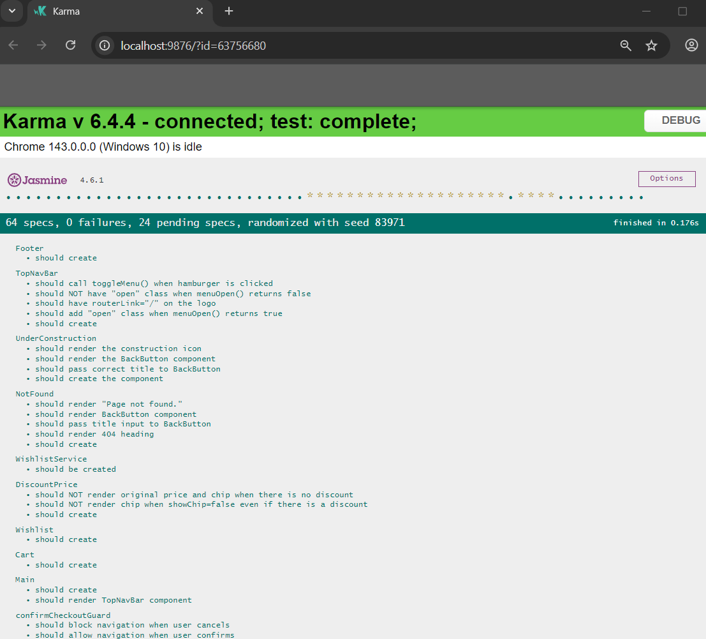

# 🛍️ SmartBuy Demo App

**SmartBuy** is a modern Angular demo application that showcases a simple marketplace experience where users can browse offers, view offer details, rate products, and manage a cart, all with clean UI, responsive design, and scalable architecture(Modular).

This project is built as an MVP using the **latest Angular standalone setup**, focusing on best practices, performance, and developer experience.

---

## 🔗 Live Demo


---

## 🚀 Tech Stack

- **Angular** (Latest, Standalone Components)
- **TypeScript**
- **Angular Router**
- **Angular Signals (state management)**
- **Angular Material Icons**
- **Modern CSS (Responsive & Mobile-first)**
- **Mock JSON Data**

---

## ✨ Features

- 🏷️ Offers listing page
- 📄 Offer details page with route resolver
- 👍👎 Vote / rating interactions
- 🛒 Add to cart & cart page
- 💖 Wishlist support
- 💳 Checkout & payment flow (secured and guard-protected)
- 📱 Fully responsive navigation (mobile + desktop)
- 🧭 Client-side routing with guards & resolvers
- 🧠 Local state management using services & signals
- 🔗 Share offers via native share button

## 🛣️ Roadmap

- ⏳ Persist cart & wishlist using localStorage
- 🔍 Offer search & filters
- 🎨 Skeleton loaders & empty states
- ♿ Accessibility improvements
- 🧪 More unit & integration tests
- 🚀 CI/CD pipeline

---

## 📦 Getting Started

### Prerequisites

- **Node.js** (LTS recommended)
- **Angular CLI** (optional)

### Installation

```bash
git clone https://github.com/satheeshpolu/smartbuy-demo-app.git
cd smartbuy-demo-app
npm install
```

## Development server

This project was generated using [Angular CLI](https://github.com/angular/angular-cli) version 20.3.5.
To start a local development server, run:

```bash
ng serve
```

Once the server is running, open your browser and navigate to `http://localhost:4200/`. The application will automatically reload whenever you modify any of the source files.

## Code scaffolding

Angular CLI includes powerful code scaffolding tools. To generate a new component, run:

```bash
ng generate component component-name
```

For a complete list of available schematics (such as `components`, `directives`, or `pipes`), run:

```bash
ng generate --help
```

## Building

To build the project run:

```bash
ng build
```

This will compile your project and store the build artifacts in the `dist/` directory. By default, the production build optimizes your application for performance and speed.

## Running unit tests

To execute unit tests with the [Karma](https://karma-runner.github.io) test runner, use the following command:

```bash
ng test
```

### Test Result



## Running end-to-end tests

For end-to-end (e2e) testing, run:

```bash
ng e2e
```

Angular CLI does not come with an end-to-end testing framework by default. You can choose one that suits your needs.

## Additional Resources

For more information on using the Angular CLI, including detailed command references, visit the [Angular CLI Overview and Command Reference](https://angular.dev/tools/cli) page.
